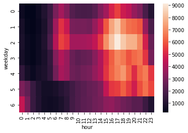

```python
import csv 

```


```python
%pylab inline 
import pandas 
import seaborn 
```

    Populating the interactive namespace from numpy and matplotlib
    


```python
data = pandas.read_csv('D:/ankur/uda.csv')
```


```python
data
```


<div>
<style scoped>
    .dataframe tbody tr th:only-of-type {
        vertical-align: middle;
    }

    .dataframe tbody tr th {
        vertical-align: top;
    }

    .dataframe thead th {
        text-align: right;
    }
</style>
<table border="1" class="dataframe">
  <thead>
    <tr style="text-align: right;">
      <th></th>
      <th>Date/Time</th>
      <th>Lat</th>
      <th>Lon</th>
      <th>Base</th>
    </tr>
  </thead>
  <tbody>
    <tr>
      <th>0</th>
      <td>4/1/2014 0:11:00</td>
      <td>40.7690</td>
      <td>-73.9549</td>
      <td>B02512</td>
    </tr>
    <tr>
      <th>1</th>
      <td>4/1/2014 0:17:00</td>
      <td>40.7267</td>
      <td>-74.0345</td>
      <td>B02512</td>
    </tr>
    <tr>
      <th>2</th>
      <td>4/1/2014 0:21:00</td>
      <td>40.7316</td>
      <td>-73.9873</td>
      <td>B02512</td>
    </tr>
    <tr>
      <th>3</th>
      <td>4/1/2014 0:28:00</td>
      <td>40.7588</td>
      <td>-73.9776</td>
      <td>B02512</td>
    </tr>
    <tr>
      <th>4</th>
      <td>4/1/2014 0:33:00</td>
      <td>40.7594</td>
      <td>-73.9722</td>
      <td>B02512</td>
    </tr>
    <tr>
      <th>...</th>
      <td>...</td>
      <td>...</td>
      <td>...</td>
      <td>...</td>
    </tr>
    <tr>
      <th>564511</th>
      <td>4/30/2014 23:22:00</td>
      <td>40.7640</td>
      <td>-73.9744</td>
      <td>B02764</td>
    </tr>
    <tr>
      <th>564512</th>
      <td>4/30/2014 23:26:00</td>
      <td>40.7629</td>
      <td>-73.9672</td>
      <td>B02764</td>
    </tr>
    <tr>
      <th>564513</th>
      <td>4/30/2014 23:31:00</td>
      <td>40.7443</td>
      <td>-73.9889</td>
      <td>B02764</td>
    </tr>
    <tr>
      <th>564514</th>
      <td>4/30/2014 23:32:00</td>
      <td>40.6756</td>
      <td>-73.9405</td>
      <td>B02764</td>
    </tr>
    <tr>
      <th>564515</th>
      <td>4/30/2014 23:48:00</td>
      <td>40.6880</td>
      <td>-73.9608</td>
      <td>B02764</td>
    </tr>
  </tbody>
</table>
<p>564516 rows × 4 columns</p>
</div>


```python
len(data)
```


    564516


```python
data['Date/Time'] = data['Date/Time'].map(pandas.to_datetime)
```


```python
print("hello")
```

    hello
    


```python

def get_dom(dt):
    return dt.day

data['dom'] = data['Date/Time'].map(get_dom)
```


```python
data.head()
```


<div>
<style scoped>
    .dataframe tbody tr th:only-of-type {
        vertical-align: middle;
    }

    .dataframe tbody tr th {
        vertical-align: top;
    }

    .dataframe thead th {
        text-align: right;
    }
</style>
<table border="1" class="dataframe">
  <thead>
    <tr style="text-align: right;">
      <th></th>
      <th>Date/Time</th>
      <th>Lat</th>
      <th>Lon</th>
      <th>Base</th>
      <th>dom</th>
    </tr>
  </thead>
  <tbody>
    <tr>
      <th>0</th>
      <td>2014-04-01 00:11:00</td>
      <td>40.7690</td>
      <td>-73.9549</td>
      <td>B02512</td>
      <td>1</td>
    </tr>
    <tr>
      <th>1</th>
      <td>2014-04-01 00:17:00</td>
      <td>40.7267</td>
      <td>-74.0345</td>
      <td>B02512</td>
      <td>1</td>
    </tr>
    <tr>
      <th>2</th>
      <td>2014-04-01 00:21:00</td>
      <td>40.7316</td>
      <td>-73.9873</td>
      <td>B02512</td>
      <td>1</td>
    </tr>
    <tr>
      <th>3</th>
      <td>2014-04-01 00:28:00</td>
      <td>40.7588</td>
      <td>-73.9776</td>
      <td>B02512</td>
      <td>1</td>
    </tr>
    <tr>
      <th>4</th>
      <td>2014-04-01 00:33:00</td>
      <td>40.7594</td>
      <td>-73.9722</td>
      <td>B02512</td>
      <td>1</td>
    </tr>
  </tbody>
</table>
</div>


```python
def get_weekday(dt):
    return dt.weekday()

data['weekday'] = data['Date/Time'].map(get_weekday)

def get_hour(dt):
    return dt.hour

data['hour'] = data['Date/Time'].map(get_hour)

data.tail()
```


<div>
<style scoped>
    .dataframe tbody tr th:only-of-type {
        vertical-align: middle;
    }

    .dataframe tbody tr th {
        vertical-align: top;
    }

    .dataframe thead th {
        text-align: right;
    }
</style>
<table border="1" class="dataframe">
  <thead>
    <tr style="text-align: right;">
      <th></th>
      <th>Date/Time</th>
      <th>Lat</th>
      <th>Lon</th>
      <th>Base</th>
      <th>dom</th>
      <th>weekday</th>
      <th>hour</th>
    </tr>
  </thead>
  <tbody>
    <tr>
      <th>564511</th>
      <td>2014-04-30 23:22:00</td>
      <td>40.7640</td>
      <td>-73.9744</td>
      <td>B02764</td>
      <td>30</td>
      <td>2</td>
      <td>23</td>
    </tr>
    <tr>
      <th>564512</th>
      <td>2014-04-30 23:26:00</td>
      <td>40.7629</td>
      <td>-73.9672</td>
      <td>B02764</td>
      <td>30</td>
      <td>2</td>
      <td>23</td>
    </tr>
    <tr>
      <th>564513</th>
      <td>2014-04-30 23:31:00</td>
      <td>40.7443</td>
      <td>-73.9889</td>
      <td>B02764</td>
      <td>30</td>
      <td>2</td>
      <td>23</td>
    </tr>
    <tr>
      <th>564514</th>
      <td>2014-04-30 23:32:00</td>
      <td>40.6756</td>
      <td>-73.9405</td>
      <td>B02764</td>
      <td>30</td>
      <td>2</td>
      <td>23</td>
    </tr>
    <tr>
      <th>564515</th>
      <td>2014-04-30 23:48:00</td>
      <td>40.6880</td>
      <td>-73.9608</td>
      <td>B02764</td>
      <td>30</td>
      <td>2</td>
      <td>23</td>
    </tr>
  </tbody>
</table>
</div>


```python
data
```


<div>
<style scoped>
    .dataframe tbody tr th:only-of-type {
        vertical-align: middle;
    }

    .dataframe tbody tr th {
        vertical-align: top;
    }

    .dataframe thead th {
        text-align: right;
    }
</style>
<table border="1" class="dataframe">
  <thead>
    <tr style="text-align: right;">
      <th></th>
      <th>Date/Time</th>
      <th>Lat</th>
      <th>Lon</th>
      <th>Base</th>
      <th>dom</th>
      <th>weekday</th>
      <th>hour</th>
    </tr>
  </thead>
  <tbody>
    <tr>
      <th>0</th>
      <td>2014-04-01 00:11:00</td>
      <td>40.7690</td>
      <td>-73.9549</td>
      <td>B02512</td>
      <td>1</td>
      <td>1</td>
      <td>0</td>
    </tr>
    <tr>
      <th>1</th>
      <td>2014-04-01 00:17:00</td>
      <td>40.7267</td>
      <td>-74.0345</td>
      <td>B02512</td>
      <td>1</td>
      <td>1</td>
      <td>0</td>
    </tr>
    <tr>
      <th>2</th>
      <td>2014-04-01 00:21:00</td>
      <td>40.7316</td>
      <td>-73.9873</td>
      <td>B02512</td>
      <td>1</td>
      <td>1</td>
      <td>0</td>
    </tr>
    <tr>
      <th>3</th>
      <td>2014-04-01 00:28:00</td>
      <td>40.7588</td>
      <td>-73.9776</td>
      <td>B02512</td>
      <td>1</td>
      <td>1</td>
      <td>0</td>
    </tr>
    <tr>
      <th>4</th>
      <td>2014-04-01 00:33:00</td>
      <td>40.7594</td>
      <td>-73.9722</td>
      <td>B02512</td>
      <td>1</td>
      <td>1</td>
      <td>0</td>
    </tr>
    <tr>
      <th>...</th>
      <td>...</td>
      <td>...</td>
      <td>...</td>
      <td>...</td>
      <td>...</td>
      <td>...</td>
      <td>...</td>
    </tr>
    <tr>
      <th>564511</th>
      <td>2014-04-30 23:22:00</td>
      <td>40.7640</td>
      <td>-73.9744</td>
      <td>B02764</td>
      <td>30</td>
      <td>2</td>
      <td>23</td>
    </tr>
    <tr>
      <th>564512</th>
      <td>2014-04-30 23:26:00</td>
      <td>40.7629</td>
      <td>-73.9672</td>
      <td>B02764</td>
      <td>30</td>
      <td>2</td>
      <td>23</td>
    </tr>
    <tr>
      <th>564513</th>
      <td>2014-04-30 23:31:00</td>
      <td>40.7443</td>
      <td>-73.9889</td>
      <td>B02764</td>
      <td>30</td>
      <td>2</td>
      <td>23</td>
    </tr>
    <tr>
      <th>564514</th>
      <td>2014-04-30 23:32:00</td>
      <td>40.6756</td>
      <td>-73.9405</td>
      <td>B02764</td>
      <td>30</td>
      <td>2</td>
      <td>23</td>
    </tr>
    <tr>
      <th>564515</th>
      <td>2014-04-30 23:48:00</td>
      <td>40.6880</td>
      <td>-73.9608</td>
      <td>B02764</td>
      <td>30</td>
      <td>2</td>
      <td>23</td>
    </tr>
  </tbody>
</table>
<p>564516 rows × 7 columns</p>
</div>


##Analysing the data


```python
hist(data.dom, bins=30, rwidth=.8, range=(0.5, 30.5))
xlabel('date of the month')
ylabel('frequency')
title('Frequency by DoM - uber - Apr 2014')
```


    Text(0.5, 1.0, 'Frequency by DoM - uber - Apr 2014')


```python
def count_rows(rows):
    return len(rows)

by_date = data.groupby('dom').apply(count_rows)
by_date
```


    dom
    1     14546
    2     17474
    3     20701
    4     26714
    5     19521
    6     13445
    7     19550
    8     16188
    9     16843
    10    20041
    11    20420
    12    18170
    13    12112
    14    12674
    15    20641
    16    17717
    17    20973
    18    18074
    19    14602
    20    11017
    21    13162
    22    16975
    23    20346
    24    23352
    25    25095
    26    24925
    27    14677
    28    15475
    29    22835
    30    36251
    dtype: int64


```python
bar(range(1, 31), by_date_sorted)
xticks(range(1,31), by_date_sorted.index)
xlabel('date of the month')
ylabel('frequency')
title('Frequency by DoM - uber - Apr 2014');

```


    ---------------------------------------------------------------------------

    NameError                                 Traceback (most recent call last)

    <ipython-input-22-4700e8b2d731> in <module>
    ----> 1 bar(range(1, 31), by_date_sorted)
          2 xticks(range(1,31), by_date_sorted.index)
          3 xlabel('date of the month')
          4 ylabel('frequency')
          5 title('Frequency by DoM - uber - Apr 2014');
    

    NameError: name 'by_date_sorted' is not defined


```python
by_date_sorted = by_date.sort_values()
by_date_sorted
```


    dom
    20    11017
    13    12112
    14    12674
    21    13162
    6     13445
    1     14546
    19    14602
    27    14677
    28    15475
    8     16188
    9     16843
    22    16975
    2     17474
    16    17717
    18    18074
    12    18170
    5     19521
    7     19550
    10    20041
    23    20346
    11    20420
    15    20641
    3     20701
    17    20973
    29    22835
    24    23352
    26    24925
    25    25095
    4     26714
    30    36251
    dtype: int64


```python
bar(range(1, 31), by_date_sorted)
xticks(range(1,31), by_date_sorted.index)
xlabel('date of the month')
ylabel('frequency')
title('Frequency by DoM - uber - Apr 2014');
```


This tells that there is maximum ride at end and beginning of month


ANALYSING THE HOUR


```python
hist(data.hour, bins=24, range=(.5, 24))
```


    (array([ 7769.,  4935.,  5040.,  6095.,  9476., 18498., 24924., 22843.,
            17939., 17865., 18774., 19425., 22603., 27190., 35324., 42003.,
            45475., 43003., 38923., 36244., 36964., 30645., 20649.,     0.]),
     array([ 0.5       ,  1.47916667,  2.45833333,  3.4375    ,  4.41666667,
             5.39583333,  6.375     ,  7.35416667,  8.33333333,  9.3125    ,
            10.29166667, 11.27083333, 12.25      , 13.22916667, 14.20833333,
            15.1875    , 16.16666667, 17.14583333, 18.125     , 19.10416667,
            20.08333333, 21.0625    , 22.04166667, 23.02083333, 24.        ]),
     <a list of 24 Patch objects>)


```python

```

Analyse the weekday 


```python

hist(data.weekday, bins=7, range =(-.5,6.5), rwidth=.8, color='#AA6666', alpha=.4)
xticks(range(7), 'Mon Tue Wed Thu Fri Sat Sun'.split())
```


    ([<matplotlib.axis.XTick at 0x1343c84b188>,
      <matplotlib.axis.XTick at 0x1343c84b148>,
      <matplotlib.axis.XTick at 0x1343c83a148>,
      <matplotlib.axis.XTick at 0x1343c87d708>,
      <matplotlib.axis.XTick at 0x1343c87df08>,
      <matplotlib.axis.XTick at 0x1343c880408>,
      <matplotlib.axis.XTick at 0x1343c880a88>],
     [Text(0, 0, 'Mon'),
      Text(0, 0, 'Tue'),
      Text(0, 0, 'Wed'),
      Text(0, 0, 'Thu'),
      Text(0, 0, 'Fri'),
      Text(0, 0, 'Sat'),
      Text(0, 0, 'Sun')])


this means that at wednesday uber hiring is at peak 

NOW ANALYSING BOTH          WEEKDAY AND HOURS TOGETHER 


```python
by_cross = data.groupby('weekday hour'.split()).apply(count_rows).unstack()
seaborn.heatmap(by_cross)
```


    <matplotlib.axes._subplots.AxesSubplot at 0x1344243ee08>





```python

```

AS CAN BE SEEN FROM ABOVE "2" CORRESPOND TO WEDNESDAY AND LIGHTER COLOUR CORRESPOND TO 16:00 TO 18:00 PM 


```python

```
